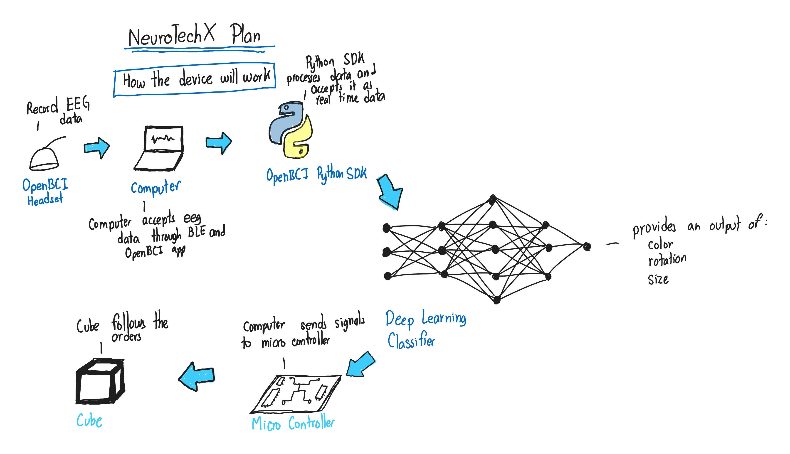
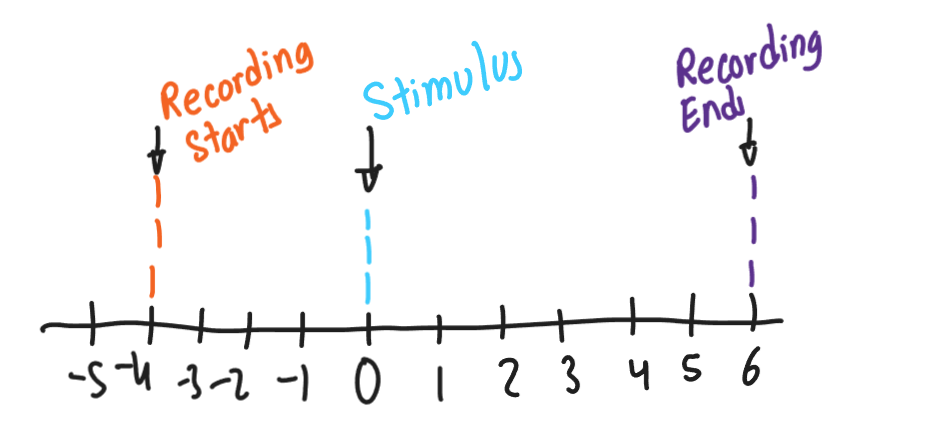

# Planning Document
## Overview
This is the planning document for the NTX project! This will contain the project overview and detail exactly what needs to be done for the NTX project.

Below is a scoping overview of the overall project. It contains the basic idea behind what needs to be done for the project to become reality.

The key idea is to build a pipeline to analyze EEG data from the openbci headset to be able to decode color, rotation and size then use that to actually impact a physical cube.

## Signal Processing
The goal for the signal processing is to analyze the brain waves taken from the EEG and prepare them for the deep learning team. The steps for the signal processing team are first going to start off with activating the OpenBCI headset and then connecting it to be read with python. From there, we'll be able to conduct signal processing and send the final signals off to the deep learning team.

An important part of signal processing will be to research the different brain waves we'll be analyzing. We need to pay careful attention to SSEVP and Visual ERPs. The starting will require signal processing to identify the types of signals we require for figuring out rotation, shape and color brain waves. It will require identification of the stimulus and figuring out how to generate the brain waves required.

The first steps for identification of brain waves will primarily be searching up research papers revolved around to identify the correct stimulus. For instance, this could involve searching up studies revolved around identifying color from EEG signals and then seeing what they used as stimulus and what brain waves they reported. 
 
## Software
At current, we need to make a software primarily for recording purposes and showing the stimulus. The way this will work is the there will be a GUI that will show the stimulus after a certain amount of time and will start showing the stimulus. Once the stimulus is shown, that time will be labeled time zero.

Below is showing the concept of the software and below that is an overview of the recording.

## Recording Overview
For the recording, we need to have labels that show when the actual stimulus occurs, when the recording starts and when the recording ends. 

## CSV Overview
To be discussed!

## Contributing to this GitHub
To contribute to the github, make your own branch of this repo and then place any and all files into the proper folders. Then, when you're ready to submit the code to the main part of the repo, start a pull request and put someone in charge of the code review to ensure that the code actually works. Make sure you write detailed pull request templates.